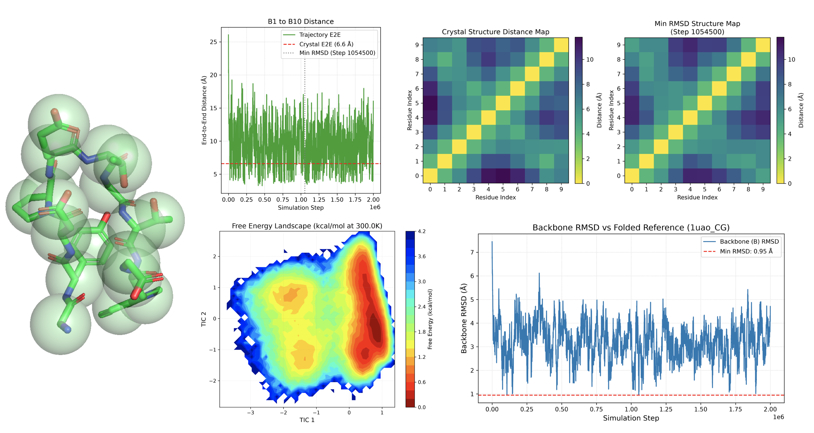

# PhysCG-ML

This repository develops a **physics-informed machine learning potential for coarse-grained molecular dynamics (CGMD)**.

The approach combines a physically motivated analytical interaction model with machine-learned parameters. The functional form of the intermolecular potential is fixed according to the relevant physical interactions, while the parameters of this function are learned from data.

  

## Physics-Informed ML Potential

The intermolecular interaction between two coarse-grained beads is defined as

$$
U(r) = U_{\mathrm{TT}}(r) + U_{\mathrm{DH}}(r),
$$

with a Tang--Toennies-type van der Waals term

$$
U_{\mathrm{TT}}(r) = \left(\frac{C_{\mathrm{rep}}}{r}\right)^{10} \cdot  f_6(br) \cdot \left(\frac{C_{\mathrm{att}}}{r}\right)^6,
$$

where the Tang--Toennies damping function is $f_6(x)=1-e^{-x}\cdot \sum_{k=0}^6\frac{x^k}{k!}$

The electrostatic contribution is described by a Debye--Hückel term

$$
U_{\mathrm{DH}}(r) = C_{\mathrm{mix}}\cdot\frac{q_1q_2}{4\pi\epsilon_0\epsilon_r r}e^{-\kappa r}
$$

The distinguishing feature of the model is that the parameters

$$
C_{\mathrm{rep}},\quad
C_{\mathrm{att}},\quad
b,\quad
C_{\mathrm{mix}}
$$

are not represented by scalar values. Instead, each parameter is represented by a **multi-component parameter vector**. The interaction parameters between two coarse-grained beads are then obtained through component-wise mixing rules. E.g. for two beads $i$ and $j$, the mixed parameters are defined as: 

$$ 
C_{\mathrm{att}}^{ij} \sqrt{
\frac{1}{N}
\sum_k^N
C_{\mathrm{att},k}^{(i)}
C_{\mathrm{att},k}^{(j)}
},
$$

Thus, the physical functional form of the potential is explicitly constrained, while machine learning determines the underlying multi-component parameters. This provides a physics-informed alternative to learning an unconstrained black-box energy function.

## Intramolecular Interactions

Intramolecular interactions are derived from structural ensembles using **Boltzmann inversion**. The required distributions are obtained from molecular configurations deposited in the input PDB data and converted into effective coarse-grained intramolecular potentials.

## Coarse-Grained Molecular Dynamics

The resulting intermolecular and intramolecular potentials are used directly for coarse-grained molecular dynamics simulations. The generated trajectories can subsequently be analysed to assess structural stability, folding behaviour, and conformational dynamics.

Detailed information on the implementation, available scripts, and analysis procedures is provided in the `src/` documentation.
